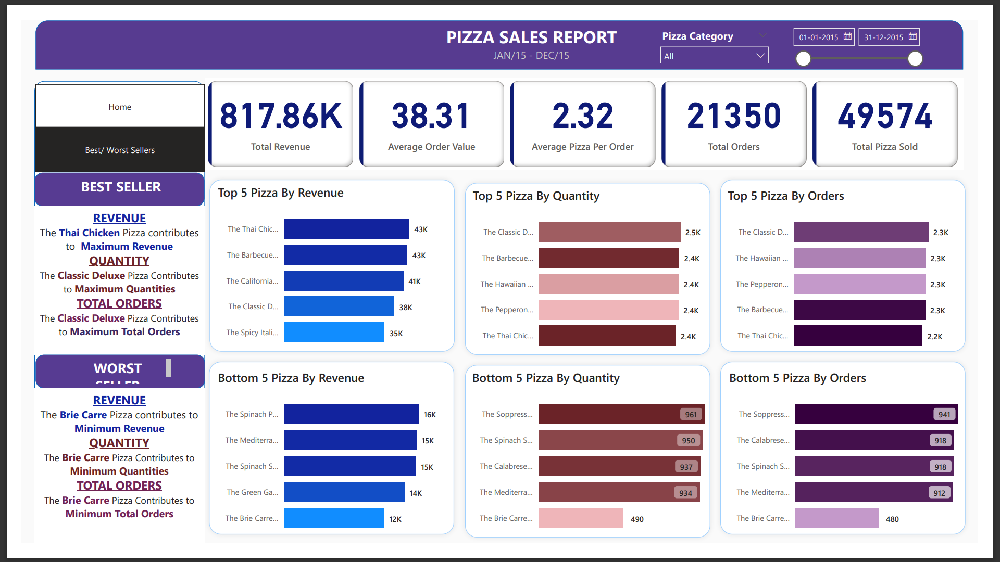
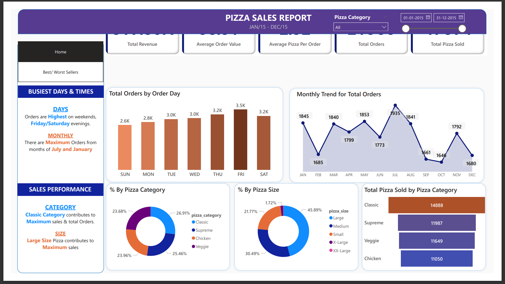

# Pizza Sales Analysis with Power BI and SQL

## Overview

This project delves into a comprehensive analysis of pizza sales using Power BI for visualization and SQL for data querying. The aim is to derive valuable insights from the sales data and present them through interactive Power BI dashboards.

## Tools Used

- **Power BI**: Utilized for creating visually engaging and interactive dashboards.
- **SQL**: Employed for data querying and analysis.

## Project Steps

1. **Data Extraction**: The pizza sales data was extracted from the database for analysis.

2. **SQL Queries for Exploration**: SQL queries were crafted to explore and analyze the data, unveiling patterns and trends.

3. **Power BI Visualization**: The insights obtained from SQL queries were visualized through Power BI dashboards, providing a dynamic representation of the findings.

## SQL Queries Documentation

For a detailed look at the SQL queries used in this project, refer to the SQL documentation [here](./PIZZA%20SALES%20SQL%20QUERIES.docx).

## Power BI Dashboard

Explore the interactive Power BI dashboard for a deeper understanding of the pizza sales analysis: [Pizza Sales Power BI Dashboard](./Pizza%20Sales.pbix)

### Screenshots

1. 
2. 

Feel free to reach out for any questions or further details!
